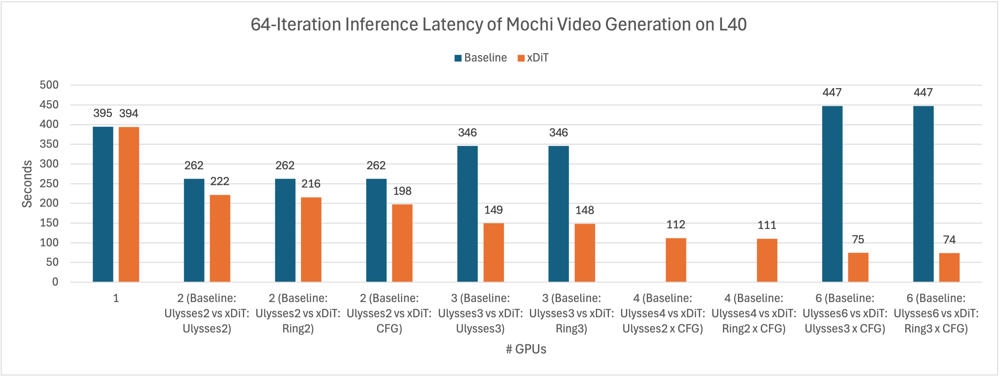
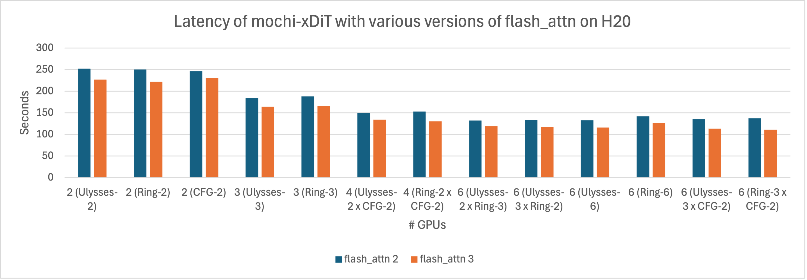

# mochi-xdit: Parallel Inference for Mochi-preview Video Generation Model with xDiT

📝 [[Blog]Enhancing Parallelism and Speedup for xDiT in Serving the Mochi-1 Video Generation Model](https://medium.com/@xditproject/exploring-the-power-of-xdit-in-speeding-up-mochis-video-generation-19f71d4f8f97)


This repository provides an accelerated way to delpoy the Video Generation Model [Mochi 1](https://github.com/genmoai/models) using Unified Sequence Parallelism provided by [xDiT](https://github.com/xdit-project/xDiT).

Mochi-1 originally ran on 4xH100(80GB) GPUs, however, we made it run on a single L40(48GB) GPU with no accuracy loss!

Moreover, by applying xDiT, we successfully reduced the latency of generating a 49-frame 848x480 resolution video from 398 seconds (6 minutes 38 seconds) to 74 seconds (1 minute 14 seconds) on 6xL40 GPUs. **It is able to reduce the inference latency by 3.54x compared to the official open source implementation on 6xL40 GPUs by improve the parallelism and better utilizing the memory!**


<div align="center">

| Metric | 1x L40 GPU | 2x L40 GPU <br>(uly=2)<br> | 2x L40 GPU <br>(cfg=2)<br> | 6x L40 GPU <br>(cfg=2, ring=3)<br> |
|:------------:|:------------:|:------------:|:------------:|:------------:|
| Performance | 394s | 222s (1.77x) | 198s (1.99x) | 74s (5.32x) |
| Memory | 30.83 GB | 35.05 GB | 36.69 GB | 30.94 GB |
| Preview |  |  |  |  |

</div>


The prompt of the video is: *"Witness a grand space battle between starships, with lasers cutting through the darkness of space and explosions illuminating the void"*.

## HightLights

1. Memory optimization makes mochi is able to generate video on a single 48GB L40 GPU without no accuracy loss.
2. Tiled VAE decoder enables the correct generation of video with any resolution, as well as reducing the memory footprint.
3. Unified Sequence Parallelism ([USP](https://github.com/feifeibear/long-context-attention)) for AsymmetricAttention using xDiT: hybrid 2D sequence parallelism with Ring-Attention and DeepSpeed-Ulysses.
4. CFG parallel from xDiT is applied by us in Mochi-1 in a simple way.

## Usage

This repository provides an accelerated inference version of [Mochi 1](https://github.com/genmoai/models) using Unified Sequence Parallelism provided by [xDiT](https://github.com/xdit-project/xDiT).

<div align="center">

| Feature            | xDiT Version      | Original Version |
|:-----------------:|:-----------------:|:----------------:|
| Attention Parallel | Ulysses+Ring+CFG | Ulysses         |
| VAE               | Variable Size     | Fixed Size      |
| Model Loading     | Replicated/FSDP   | FSDP            |

</div>


## Usage

### 1. Install from source

```shell
pip install xfuser
sudo apt install ffmpeg
pip install .
```

### 2. Install from docker

```shell
docker pull thufeifeibear/mochi-dev:0.1
```

### 3. Run

Running mochi with a single GPU

```shell
CUDA_VISIBLE_DEVICES=0 python3 ./demos/cli.py --model_dir "<path_to_downloaded_directory>" --prompt "prompt"
```

Running mochi with multiple GPUs using Unified Sequence Parallelism provided by [xDiT](https://github.com/xdit-project/xDiT).

world_size is the total number of GPU used for video generation. Use the number of GPUs in CUDA_VISIBLE_DEVICES to control world_size.

Adjust the configuration of ulysses_degree, ring_degree, and CFG parallel degree to achieve optimal performance. If cfg_parallel is enabled, ulysses_degree x ring_degree = world_size. Otherwise, ulysses_degree x ring_degree = world_size.

E.g.,

```shell
export CUDA_VISIBLE_DEVICES=0,1,2,3,4,5
python3 ./demos/cli.py --model_dir "<path_to_downloaded_directory>" --prompt "prompt" \
 --use_xdit --ulysses_degree 3 --ring_degree 2
```
or

```shell
export CUDA_VISIBLE_DEVICES=0,1,2,4,5,6
python3 ./demos/cli.py --model_dir "<path_to_downloaded_directory>" --prompt "prompt" \
 --use_xdit --ulysses_degree 3 --ring_degree 1 --cfg_parallel
```

### 4. Performance

The comparison in latency betweem mochi-xDiT and the original mochi inference (Baseline) is shown as follows.



We also try flash_attn 3 with FP8 support on Hopper GPUs. The latency of mochi-xDiT with flash_attn 2 and flash_attn 3 are compared in the following figure.



### References

[xDiT: an Inference Engine for Diffusion Transformers (DiTs) with Massive Parallelism](https://arxiv.org/abs/2411.01738)

```
@article{fang2024xdit,
  title={xDiT: an Inference Engine for Diffusion Transformers (DiTs) with Massive Parallelism},
  author={Fang, Jiarui and Pan, Jinzhe and Sun, Xibo and Li, Aoyu and Wang, Jiannan},
  journal={arXiv preprint arXiv:2411.01738},
  year={2024}
}

```

[USP: A Unified Sequence Parallelism Approach for Long Context Generative AI](https://arxiv.org/abs/2405.07719)

```
@article{fang2024unified,
  title={A Unified Sequence Parallelism Approach for Long Context Generative AI},
  author={Fang, Jiarui and Zhao, Shangchun},
  journal={arXiv preprint arXiv:2405.07719},
  year={2024}
}

```

[Unveiling Redundancy in Diffusion Transformers (DiTs): A Systematic Study](https://arxiv.org/abs/2411.13588)

```
@article{sun2024unveiling,
  title={Unveiling Redundancy in Diffusion Transformers (DiTs): A Systematic Study},
  author={Sun, Xibo and Fang, Jiarui and Li, Aoyu and Pan, Jinzhe},
  journal={arXiv preprint arXiv:2411.13588},
  year={2024}
}

```

