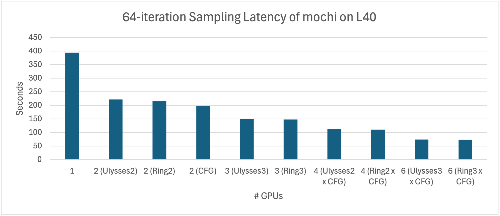

# mochi-xdit: Faster Parallel Inference of Mochi-preview Video Generation Model with xDiT

This repository provides an accelerated way to delpoy the Video Generation Model [Mochi 1](https://github.com/genmoai/models) using Unified Sequence Parallelism provided by [xDiT](https://github.com/xdit-project/xDiT).

Mochi-1 originally ran on 4xH100(80GB) GPUs, however, we made it run on a single L40(48GB) GPU with no accuracy loss!

Moreover, by applying xDiT, we successfully reduced the latency of generating a 49-frame 848x480 resolution video from 398 seconds (6 minutes 38 seconds) to 74 seconds (1 minute 14 seconds) on 6xL40 GPUs. 


<div align="center">

| Metric | 1x L40 GPU | 2x L40 GPU <br>(uly=2)<br> | 2x L40 GPU <br>(cfg=2)<br> | 6x L40 GPU <br>(cfg=2, ring=3)<br> |
|:------------:|:------------:|:------------:|:------------:|:------------:|
| Performance | 398.00s | 216.50s | 199.07s | 74.06s |
| Memory | 30.83 GB | 35.05 GB | 36.69 GB | 30.94 GB |
| Preview |  |  |  |  |

</div>


The prompt of the video is: *"Witness a grand space battle between starships, with lasers cutting through the darkness of space and explosions illuminating the void"*.

## HightLights

1. Memory optimization makes mochi is able to generate video on a single 48GB L40 GPU without no accuracy loss.
2. Tiled VAE decoder enables the correct generation of video with any resolution, as well as reducing the memory footprint.
3. Unified Sequence Parallelism ([USP](https://github.com/feifeibear/long-context-attention)) for AsymmetricAttention using xDiT: hybrid 2D sequence parallelism with Ring-Attention and DeepSpeed-Ulysses.
4. CFG parallel from xDiT is applied by us in Mochi-1 in a simple way.

## Usage

This repository provides an accelerated inference version of [Mochi 1](https://github.com/genmoai/models) using Unified Sequence Parallelism provided by [xDiT](https://github.com/xdit-project/xDiT).

<div align="center">

| Feature            | xDiT Version      | Original Version |
|:-----------------:|:-----------------:|:----------------:|
| Attention Parallel | Ulysses+Ring+CFG | Ulysses         |
| VAE               | Variable Size     | Fixed Size      |
| Model Loading     | Replicated/FSDP   | FSDP            |

</div>


## Usage

### 1. Install from source

```shell
pip install xfuser
sudo apt install ffmpeg
pip install .
```

### 2. Install from docker

```shell
docker pull thufeifeibear/mochi-dev:0.1
```

### 3. Run

Running mochi with a single GPU

```shell
CUDA_VISIBLE_DEVICES=0 python3 ./demos/cli.py --model_dir "<path_to_downloaded_directory>" --prompt "prompt"
```

Running mochi with multiple GPUs using Unified Sequence Parallelism provided by [xDiT](https://github.com/xdit-project/xDiT).

world_size is the total number of GPU used for video generation. Use the number of GPUs in CUDA_VISIBLE_DEVICES to control world_size.

Adjust the configuration of ulysses_degree, ring_degree, and CFG parallel degree to achieve optimal performance. If cfg_parallel is enabled, ulysses_degree x ring_degree = world_size. Otherwise, ulysses_degree x ring_degree x 2 = world_size.

E.g.,

```shell
export CUDA_VISIBLE_DEVICES=0,1,2,3
python3 ./demos/cli.py --model_dir "<path_to_downloaded_directory>" --prompt "prompt" \
 --use_xdit --ulysses_degree 2 --ring_degree 2
```
or

```shell
export CUDA_VISIBLE_DEVICES=0,1,2,4,5,6
python3 ./demos/cli.py --model_dir "<path_to_downloaded_directory>" --prompt "prompt" \
 --use_xdit --ulysses_degree 3 --ring_degree 1 --cfg_parallel
```

### 4. Performance



### References

[xDiT: an Inference Engine for Diffusion Transformers (DiTs) with Massive Parallelism](https://arxiv.org/abs/2411.01738)

```
@misc{fang2024xditinferenceenginediffusion,
      title={xDiT: an Inference Engine for Diffusion Transformers (DiTs) with Massive Parallelism}, 
      author={Jiarui Fang and Jinzhe Pan and Xibo Sun and Aoyu Li and Jiannan Wang},
      year={2024},
      eprint={2411.01738},
      archivePrefix={arXiv},
      primaryClass={cs.DC},
      url={https://arxiv.org/abs/2411.01738}, 
}
```

[USP: A Unified Sequence Parallelism Approach for Long Context Generative AI](https://arxiv.org/abs/2405.07719)

```
@misc{fang2024uspunifiedsequenceparallelism,
      title={USP: A Unified Sequence Parallelism Approach for Long Context Generative AI}, 
      author={Jiarui Fang and Shangchun Zhao},
      year={2024},
      eprint={2405.07719},
      archivePrefix={arXiv},
      primaryClass={cs.LG},
      url={https://arxiv.org/abs/2405.07719}, 
}
```

